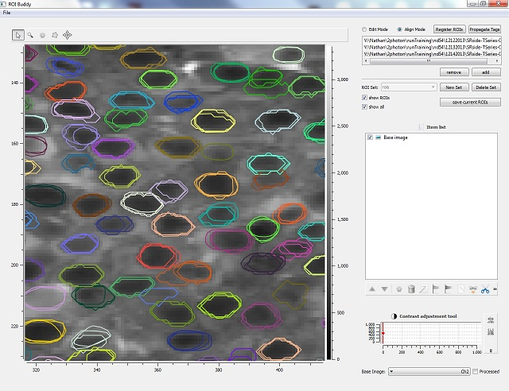
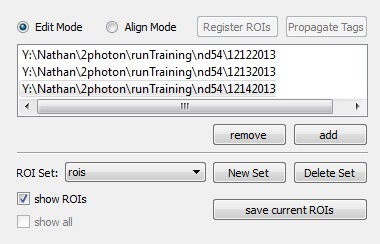

*************
ROI Buddy GUI
*************

.. Contents::

Introduction
============

The ROI Buddy GUI can be used for viewing, creating, editing, and tagging the
regions of interest (ROIs) associated with multiple SIMA imaging datasets
simultaneously.
In addition it can be used for registering ROIs from different imaging
sessions of the same field-of-view, allowing for the longitudinal tracking of
cells in serial imaging experiments.

Typical Workflow
----------------
* Load multiple SIMA imaging datasets corresponding to different recordings of the same field of view.
* For each dataset, select the channel you wish to edit and align.
* Create or load pre-drawn ROIs for each dataset, editing the ROIs as necessary in Edit Mode.
* Tag cells in one dataset based on some criteria, e.g. morphology.
* Enter Align mode, bringing all the ROIs into alignment.
* Choose "Register ROIs" to assign a common ``id`` property to overlapping ROIs.
* Use the merge and unmerge tools to manually fix any incorrect groupings.
* Once registration is satisfactory, choose "Propagate Tags" to assign the morphology tags to all matched ROIs across imaging sessions.
* Save ROIs.

Installation
============

The ROI Buddy GUI has the following dependencies which should be installed
prior to installation of ROI Buddy:

* `SIMA <https://pypi.python.org/pypi/sima>`_ >= 1.0
* `PyQt4 <http://www.riverbankcomputing.co.uk/software/pyqt>`_
* `PythonQwt <https://github.com/PierreRaybaut/PythonQwt>`_
* `guidata <https://pypi.python.org/pypi/guidata>`_ >= 1.7.0
* `guiqwt <https://pypi.python.org/pypi/guiqwt>`_ >= 3.0.0

In addition, transforming or registering ROIs across sessions requires an
optional SIMA dependency:

* `OpenCV <http://opencv.org>`_ >= 2.4.8

Once these dependencies are installed, the ROI Buddy can be installed from 
the Python Package Index using pip.::

    $ pip install roibuddy --user

Alternatively, the ROI Buddy GUI can be built from source. Source code for
released versions can be downloaded from the `Python Package Index
<https://pypi.python.org/pypi/roibuddy>`__, and code under development can be
downloaded from the project's `GitHub page
<https://github.com/losonczylab/roibuddy>`__.

Once installed, ROI Buddy can be run either by::

    $ roibuddy

or::

    $ python -m roibuddy

If these commands do not work, check the output of the installation command to
determine the directory where the executable was placed, and either add this
directory to your path or run the executable directly from that location.

As an alternative, you can also run ROI Buddy from a
`Docker <https://www.docker.com/>`_ container, see :ref:`docker setup<docker-setup-roibuddy>`.

Windows
-------
After installing `SIMA <install.html>`__, we recommend installing pre-compiled
wheels from (http://www.lfd.uci.edu/~gohlke/pythonlibs/) in this order:

* `PyQt4 <http://www.lfd.uci.edu/~gohlke/pythonlibs/#pyqt4>`_
* `PythonQwt <http://www.lfd.uci.edu/~gohlke/pythonlibs/#pythonqwt>`_
* `guidata <http://www.lfd.uci.edu/~gohlke/pythonlibs/#guiqwt>`_ >= 1.7.0
* `guiqwt <http://www.lfd.uci.edu/~gohlke/pythonlibs/#guiqwt>`_ >= 3.0.0

before installing ROI Buddy from the
`Python Package Index <https://pypi.python.org/pypi/roibuddy>`__.

Mac OS X
--------
We recommend using MacPorts for installing the dependencies. 
After installing SIMA using MacPorts as described `here <install.html>`__,
run the following command in Terminal to install an additional dependency::

    $ sudo port install py27-pyqwt

Then download and install `guidata <https://code.google.com/p/guidata/>`__ and
`guiqwt <https://code.google.com/p/guiqwt/>`__ before installing ROI Buddy from
the `Python Package Index <https://pypi.python.org/pypi/roibuddy>`__.

.. _docker-setup-roibuddy:

Docker
------
`Docker <https://www.docker.com/>`_ images are pre-built installations
that you can run immediately on your local machine. To run ROI Buddy from a
Docker container, first follow the Docker Engine
`installation <https://docs.docker.com/engine/installation/>`_ instructions
for your operating system. You will also need an X Windows server installed
on your machine. On linux, this is most likely already installed, newer
versions of OS X can install `XQuartz <https://www.xquartz.org/>`_, and on
Windows we recommend either `Xming <https://sourceforge.net/projects/xming/>`_
or `MobaXterm <http://mobaxterm.mobatek.net/>`_.

From a docker terminal run the latest ROI Buddy image (it will automatically be downloaded), with::

    $ docker run -it --rm --net=host --env="DISPLAY" -v $HOME/.Xauthority:/root/.Xauthority:rw
        -v /PATH/TO/DATA:/data --name roibuddy losonczylab/roibuddy

If you have issues launching the ROI Buddy image, make sure your DISPLAY
environment variable is set correctly to reach the X server that you are running.

User Interface
==============
File Menu
---------
.. csv-table::
    :file: roi_buddy/File_Menu.csv
    :header: "File Menu Option", "Action"
    :widths: 1, 4

Control Panel
-------------

Toggling modes
++++++++++++++
.. csv-table::
    :file: roi_buddy/control_panel_modes.csv
    :widths: 1, 4

Initializing SIMA imaging dataset and ROI List objects
++++++++++++++++++++++++++++++++++++++++++++++++++++++
.. csv-table::
    :file: roi_buddy/control_panel_initialize_sets.csv
    :widths: 1, 4

Registering ROI objects across multiple imaging sessions
++++++++++++++++++++++++++++++++++++++++++++++++++++++++
If multiple datasets have been loaded from the same field of view, it is possible to align the ROIs and commonly identify them
so that they can be tracked across sessions. The currently selected dataset will act as a template to which all other datasets
will be aligned. Each dataset is automatically aligned to the template dataset by calculating an affine transformation between
time averaged images that produces maximal similarity. A clustering algorithm based on the Jaccard Index is used to match cells 
between datasets, which can be manually adjusted by merging/unmerging ROIs from the automatic clusters. Once registered, ROIs that
are matched across days are assigned the same ``id`` property which is denoted visibly by giving them all the same color.

.. csv-table::
    :file: roi_buddy/control_panel_registration.csv
    :widths: 1, 4

.. warning::
    In align mode, it is necessary that all imaging datasets loaded must be
    roughly of the same field of view.  Alignment is based upon an affine
    transformation with 6 degrees of freedom.  If a transform between
    time averaged images cannot be calculated, an error message will be displayed printing
    the directories of the incompatible sets.

Toggling the visibility of ROIs
+++++++++++++++++++++++++++++++
.. csv-table::
    :file: roi_buddy/control_panel_view_rois.csv
    :widths: 1, 4

Keyboard shortcuts
==================

:ctrl + o: add a single t-series .sima folder
:ctrl + s: save the current ROI set to file
:ctrl + a: select all of the ROIs

:e (edit mode): merge separate ROIs into a single ROI object
:m (align mode): merge selected ROIs into the same cluster, assigning them the same ID attribute
:u (align mode): unmerge ROI from its cluster and assign it a unique ID attribute
:f (edit mode): select freeform tool
:s (edit mode): select pointer-selection tool
:d: delete
:r: randomize ROI colors
:t: add tags to selected ROIs
:c: clear tags from selected ROIs
:z: undo deleting an ROI
:y: redo deletion of an ROI

:ctrl + q: close ROI Buddy

